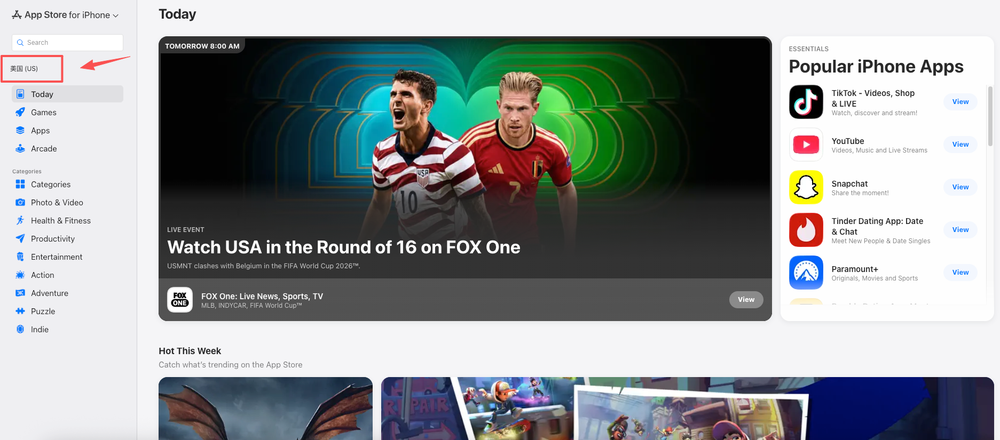

# Apple Store Redirect Guard

Prevents Apple from redirecting non-China App Store pages back to China based on your IP.

[中文](README.md)

## Problem

When visiting a non-China App Store link, Apple redirects the page to the China Today page if your IP appears to be from China.

## Features

| Feature | Description |
|---------|-------------|
| Preserve target country/region | `/us/`, `/jp/`, and other country-code links stay on their intended storefront |
| Block client-side redirects | Page scripts attempting to redirect to China are rewritten back to the target country/region |
| Works for any non-China region | Any `apps.apple.com/{country-code}/...` link is supported |

## Installation

1. Open Chrome / Edge and go to `chrome://extensions/` (or `edge://extensions/`).
2. Enable **Developer mode**.
3. Click **Load unpacked** and select this project folder.

## Quick Country/Region Switch

After installing the extension, a button showing the current country/region (e.g., "United States (US)") will appear at the top of the left sidebar on App Store pages. Click it to switch between 37 countries/regions, including China mainland (CN).

